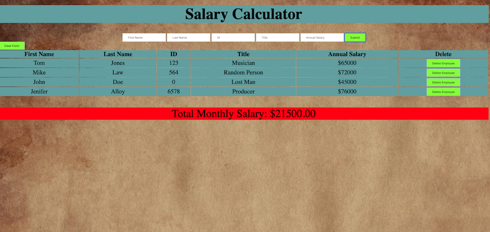

# JQuery Salary Calculator

## Description
Duration: 10 hours

JQuery Salary Calculator is a web application designed to store vital employee information and assist with salary related budget concerns.

A user can input or remove employee information. The view will also notify the user if the total salary of all employees exceeds the allowed budget.

## Screen Shots

## Usage
 1. Begin using the application by filling out the fields of the form (First Name, Last Name, Employee ID, Title, and Annual Salary). If you filled anything out incorrectly push the clear form button to reset the inputs.
 2. When the form is filled out completely click the Submit button, this will add the new employee to the list of employees.
 3. There is a line labeled: Total Monthly Salary. This will show the combined monthly salaries of all employees.
 4. If the combined monthly salaries of all employees exceeds the allowed budget (Currently set at $20,000), a red background will appear behind Total Monthly Salary.
 5. If an employee is no longer with your organization, they can be removed via the delete button on the far right hand side of the table. Doing so will also update the Total Monthly Salary.

## Built With
Html, CSS, Javascript, jquery-3.4.1

## Acknowledgement
Thanks to Prime Digital Academy in Kansas City who equipped and helped me to make this application a reality. Specifically Scott, Myron, and the Tyto cohort.

## Support
If you have suggestions or issues, please email me at allenlucke@gmail.com
